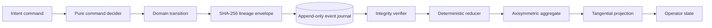

# Axisymmetric Kinematic Consensus Protocol

[](https://github.com/nullroar/axisymmetric-kinematic-consensus/actions/workflows/ci.yml)
[](./spec/AKCP-1.md)
[](./docs/invariants.md)
[](./LICENSE)

AKCP is a deterministic, event-sourced consensus substrate for projecting
axisymmetric phase transitions into linear displacement.

The kernel formalizes a deceptively under-specified systems problem: given a
radial metric and a sequence of angular transitions, every conforming runtime
must converge on the same phase, displacement, residual precision, lifecycle,
and cryptographic event lineage—without relying on floating-point state.

## Why this exists

Conventional implementations collapse topology, arithmetic, persistence, and
coordination into a single multiplication. That approach leaves several
questions unanswered:

- Is phase represented on ℝ, S¹, or an implementation-defined approximation?
- How is sub-unit precision preserved across partitioned transitions?
- Can two observers replay the same motion and prove identical state?
- What happens when commands are retried or delivered concurrently?
- How is historical mutation detected after persistence?
- Which representation remains portable across JavaScript engines and storage
  boundaries?

AKCP answers those questions with an explicit protocol.

## Architectural topology



The implementation separates:

1. **Intent** — idempotent commands with correlation lineage.
2. **Decision** — pure domain validation and transition derivation.
3. **Fact** — immutable events in cryptographically chained envelopes.
4. **State** — a fold over verified event history.
5. **Projection** — integer tangential displacement with residual transport.
6. **Observation** — protocol-neutral metrics and operator output.

## Deterministic numeric model

Angular quantities are signed integer nanoradians. Linear quantities are signed
integer micrometers. For radius `r`, angular delta `θ`, scale `s = 10⁹`, and
transported residual `ε`, the projection is:

```text
n = rθ + ε
Δx = floor(n / s)
ε′ = n - Δx·s
```

Transporting `ε′` makes partitioning observationally irrelevant:

```text
project(θ₁); project(θ₂) ≡ project(θ₁ + θ₂)
```

No binary floating-point value enters durable state or digest material.

## Quick start

Requires Node.js 22 or later.

```bash
npm install
npm run verify
npm run demo
```

Initialize a stream with a 100 mm radial metric and advance it by one radian:

```bash
npm run build
node dist/src/cli.js init primary-axis 100
node dist/src/cli.js advance primary-axis 1
node dist/src/cli.js inspect primary-axis
```

The default journal is `.akcp/journal.jsonl`. Every record contains its stream
version, predecessor digest, command identity, correlation identity, timestamp,
domain event, and own SHA-256 digest.

## Library surface

```ts
import {
  aggregateId,
  AxisymmetricOrchestrator,
  ConsensusEngine,
  MemoryEventStore,
  SystemClock,
} from "@nullroar/axisymmetric-kinematic-consensus";

const engine = new ConsensusEngine(
  new MemoryEventStore(),
  new SystemClock(),
);
const protocol = new AxisymmetricOrchestrator(engine);

await protocol.initialize("primary-axis", "100");
await protocol.advance(aggregateId("primary-axis"), "1.570796327");

const state = await engine.inspect(aggregateId("primary-axis"));
```

## Guarantees

Given a valid AKCP-1 event stream, a conforming implementation guarantees:

- canonical phase in the half-open interval `[0, τ)`;
- bitwise deterministic replay;
- partition-invariant fixed-point displacement;
- optimistic concurrency at the stream boundary;
- command-level idempotency;
- cryptographic detection of event or snapshot mutation;
- explicit lifecycle rejection after retirement;
- absence of floating-point values from consensus state.

See [protocol specification](./spec/AKCP-1.md),
[invariants](./docs/invariants.md), and
[threat model](./docs/threat-model.md) for normative details.

## Repository map

| Path | Responsibility |
| --- | --- |
| `src/domain` | Branded quantities, commands, events, state, invariants |
| `src/math` | Fixed-point arithmetic and cyclotomic normalization |
| `src/kernel` | Decision, reduction, integrity, snapshots, serialization |
| `src/ports` | Clock, event-store, and telemetry contracts |
| `src/adapters` | In-memory, JSONL, system clock, Prometheus exposition |
| `spec` | Normative AKCP-1 protocol and schemas |
| `docs/adr` | Architectural decision records |
| `test` | Unit, integrity, replay, and generative property verification |

## Project posture

AKCP-1 is a stable reference protocol with an independently versioned package
surface. The public API follows semantic versioning; protocol compatibility
follows the independent rules in [AKCP-1](./spec/AKCP-1.md).

Contributions should begin with
[the contributor guide](./CONTRIBUTING.md) and preserve the consensus
invariants. Architectural shortcuts require an ADR.
