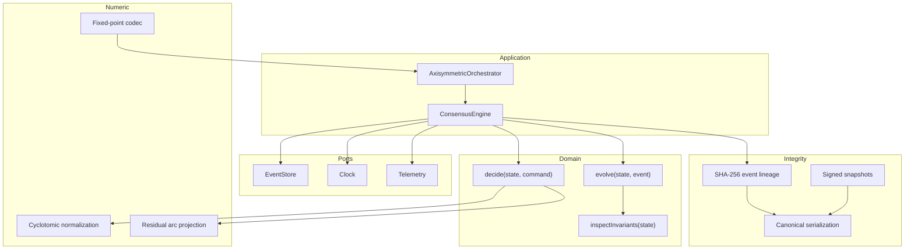

# Architecture

AKCP uses functional core / imperative shell, command-query responsibility
segregation, event sourcing, and hexagonal boundaries. These are not deployment
requirements; they are mechanisms for keeping consensus behavior observable and
replayable.

## Component graph



## Write path

1. The application assigns a command identity and correlation identity.
2. The engine loads the complete aggregate stream.
3. The engine verifies stream contiguity, predecessor linkage, and each digest.
4. The reducer reconstructs current state.
5. The pure decider accepts or rejects intent.
6. Accepted domain events receive versions and cryptographic envelopes.
7. The store performs compare-and-append against the observed version.
8. The reducer folds the newly persisted events into returned state.

This ordering prevents unverified state from influencing decisions and prevents
state from being reported before durable append succeeds.

## Read path

There is no mutable read model in the reference implementation. Inspection
loads, verifies, and folds the event stream. Production adapters may introduce
snapshots or materialized projections if they preserve the terminal digest and
stream-version proof.

## Dependency rule

Dependencies point inward:

```text
adapters → ports ← application → kernel → domain ← math
```

The domain and numeric layers import neither persistence nor operator concerns.
The architecture verifier enforces the most consequential import boundaries.

## Consistency model

Each aggregate stream is linearizable at its append boundary when the backing
adapter provides atomic compare-and-append. Different aggregates are
independent. AKCP does not claim multi-stream serializability.

The bundled JSONL adapter is an operator and demonstration adapter. It provides
version checks within one process, not a cross-process locking protocol.

## Failure semantics

Errors are classified:

- `DomainRejection`: valid protocol input refused by lifecycle or domain rules;
- `ConcurrencyConflict`: observed stream version was stale;
- `IntegrityViolation`: persisted lineage or reducer continuity is invalid;
- `InvariantViolation`: a transition produced prohibited aggregate state;
- `ProtocolViolation`: representation cannot be decoded canonically.

Callers should retry only concurrency conflicts and transport failures. Domain
and integrity failures require intervention.
