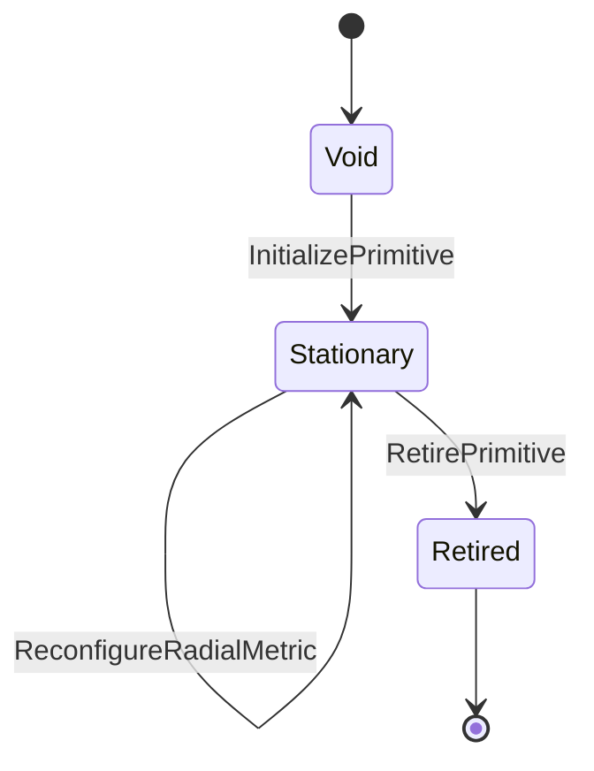

# Protocol lifecycle

An aggregate has three lifecycle states.

The term `Stationary` describes orchestration state between atomic transitions;
it does not assert zero cumulative displacement.

## Void

The aggregate has no identity, radial metric, history, or terminal digest.
Only `InitializePrimitive` is admissible.

## Stationary

The aggregate is materialized and accepts phase advancement, radial
reconfiguration, or retirement. Commands are evaluated against state rebuilt
from verified history.

## Retired

The aggregate is immutable. Inspection and cryptographic verification continue
to work, but every new domain command is rejected.

## Empty event decisions

Reconfiguring to the already active radial metric is an accepted no-op. The
decision emits no event, does not increment the stream version, and returns
unchanged state. This differs from idempotent replay: a no-op command identity
is not persisted and therefore is not remembered by the reference kernel.
